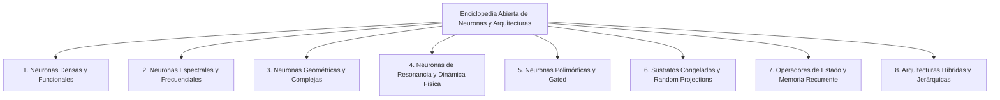

# Enciclopedia Abierta de Neuronas, Capas y Arquitecturas (Open Neural Encyclopedia - ONE)

> 🌐 **VISIÓN Y MANIFIESTO DEL PROYECTO:** Creación del catálogo abierto, centralizado y empíricamente auditado más completo sobre la taxonomía de neuronas, transformadas, capas y arquitecturas de Deep Learning.

---

## 1. Declaración de Misión y Filosofía

El avance del Deep Learning se ha visto acotado por la hegemonía de un único paradigma: la neurona densa tradicional ($y = \sigma(Wx + b)$) combinada con multiplicación de matrices y atención $O(N^2)$. Sin embargo, el espacio de hipótesis de la computación neuronal es inmenso: incluye geometrías en el plano complejo $\mathbb{C}$, transformadas espectrales ultrarrápidas (Walsh-Hadamard, Fourier, Wavelets), osciladores de resonancia física y sustratos congelados.

**La Enciclopedia Abierta de Neuronas y Arquitecturas (ONE)** nace con un propósito sagrado: **mapear, categorizar y auditar empíricamente cada tipo de neurona y capa existente o por inventar**.

No es un documento estático de divulgación, sino una **base de conocimiento viva y auditable**, donde cada entrada incluye la formulación matemática exacta, su historia, requerimientos de hardware, coste en FLOPS, benchmark de generalización OOD y referencias a implementaciones reales en el código.

---

## 2. Esquema de Ficha Técnica Canónica (Los 10 Vectores de Medición)

Cada neurona, capa o transformada registrada en la Enciclopedia debe contar con una **Ficha Técnica Canónica** estandarizada que contiene exactamente 10 dimensiones de evaluación:

```
┌────────────────────────────────────────────────────────────────────────┐
│ FICHA TÉCNICA CANÓNICA — OPEN NEURAL ENCYCLOPEDIA (ONE)                │
├────────────────────────────────────────────────────────────────────────┤
│ 1. Formulación Matemática & Origen Histórico                           │
│ 2. Hiperparámetros & Optimizador (LR, Warmup, Weight Decay)            │
│ 3. Presupuesto Paramétrico & Intensidad Aritmética (FLOPS / Bytes)     │
│ 4. Desempeño y Métrica Principal (Accuracy, PPL, Val Loss)             │
│ 5. Dominio de Tarea & Benchmarks (MQAR, LM, Visión, Audio, Control)    │
│ 6. Perfil de Hardware & Latencia Real (CPU, GPU DirectML, FPGA, ASIC)  │
│ 7. Generalización Out-of-Distribution (OOD) & Robustez                 │
│ 8. Interpretabilidad & Geometría del Espacio de Estados                │
│ 9. Trazabilidad de Código & Scripts del Corpus                         │
│ 10. Amenazas a la Validez, Anomalías & Bugs Conocidos (⚠️)             │
└────────────────────────────────────────────────────────────────────────┘
```

---

## 3. Taxonomía General del Catálogo

El catálogo se estructura en **8 Grandes Familias Neuronales**:



---

### Familia 1: Neuronas Densas y Funcionales (Classical & Basis Adaptation)
* **Neurona Densa Estándar (Perceptrón):** $y = \sigma(Wx + b)$. Baselines ReLU, GELU, SiLU.
* **Neuronas Senoidales (SIREN):** $y = \sin(\omega_0 Wx + b)$. Representaciones implícitas continuas (INR).
* **Neuronas Racionales:** $y = \frac{P(x)}{Q(x)}$. Funciones de activación adaptativas de aproximación padé.
* **Redes Kolmogorov-Arnold (KAN):** Neuronas donde los pesos son funciones spline adaptativas en las aristas ($y = \sum \phi_{i,j}(x_i)$).

### Familia 2: Neuronas Espectrales y Frecuenciales (Fast Transform Operators)
* **Transformada Rápida de Walsh-Hadamard (FWHT / Spec-RAMA):** Mezcla espectral binaria $O(N \log N)$ mediante operaciones aditivas puras sin multiplicaciones.
* **Transformada de Fourier Rápida (FFT / FNO):** Operadores diferenciales en el dominio de frecuencias compuestas $\mathbb{C}$.
* **Transformada Discreta del Coseno (DCT):** Filtrado de frecuencias reales y compresión espectral.
* **Transformada de Wavelets (DWT):** Análisis multirresolución tiempo-frecuencia localizado.
* **Proyecciones Polinomiales (Chebyshev / Legendre):** Bases ortogonales rígidas para aproximación de curvas.

### Familia 3: Neuronas Geométricas y de Fase Compleja (Complex & Clifford Space)
* **Atención de Fase Compleja (`DeltaPhase`):** Claves y consultas parametrizadas sobre el círculo unitario $S^1 \subset \mathbb{C}^{d_k}$ ($K = e^{i\theta}$).
* **Neuronas Cuaterniónicas y Álgebra de Clifford:** Operaciones sobre $\mathbb{H}$ y álgebra espacial multidimensional para rotaciones 3D/4D.
* **Neuronas CORDIC:** Rotación de fase discreta $B$-bit basada en desplazar bits (`shift-and-add`) sin multiplicadores.
* **Neuronas Hiperbólicas / Poincaré:** Embeddings en espacio de curvatura negativa para estructuras jerárquicas y árboles.

### Familia 4: Neuronas de Resonancia y Dinámica Física (Continuous & Spiking)
* **Osciladores de Kuramoto / Resonancia:** Neuronas de acoplamiento de fase que sincronizan patrones por resonancia armónica.
* **Liquid Time-Constant (LTC / Neural ODEs):** Sistemas dinámicos continuos gobernados por ecuaciones diferenciales.
* **Neuronas Spiking (LIF - Leaky Integrate-and-Fire):** Computación asíncrona guiada por impulsos de eventos discretos.

### Familia 5: Neuronas Polimórficas y Gated (Dynamic Routing)
* **Mecanismos SwiGLU / GeGLU:** Multiplicación de elementos con puertas de activación no lineales ($x W_1 \cdot \text{SiLU}(x W_2)$).
* **Enrutamiento por Cápsulas (Capsule Networks):** Preservación de relaciones parte-todo mediante enrutamiento por acuerdo.
* **Mixture of Experts (MoE Routers):** Conmutación dinámica de sub-redes activadas según la entrada.

### Familia 6: Neuronas con Sustratos Congelados (Fixed-Seed & Reservoir)
* **Reservoir Computing / Echo State Networks:** Matrices recurrentes aleatorias congeladas donde solo se entrena la cabeza lineal.
* **Proyecciones Aleatorias Congeladas (Random Projections / ELM):** Mapeo de alta dimensión no entrenable para separación lineal directa.
* **Proyecciones Hadamard Estáticas:** Matrices de Hadamard ortogonales prefijadas como mezcladores de canal sin parámetros.

### Familia 7: Operadores de Estado y Memoria Recurrente (SSM & Linear Attention)
* **Modelos de Espacio de Estados (S4, Mamba):** Convoluciones asociativas continuas guiadas por matrices $A, B, C$.
* **DeltaNet (Real & Rectangular):** Memoria asociativa con regla de actualización delta ($M_t = M_{t-1} + \beta(v - M_{t-1} k) k^T$).
* **RWKV & Retention:** Atención lineal con decaimiento exponencial del estado.

### Familia 8: Arquitecturas Híbridas y Jerárquicas
* **Transformers Híbridos Espectral-Atención:** Combinación de capas Hadamard/FFT de alta velocidad con capas de atención en puntos críticos.
* **Redes Multiescala Jerárquicas:** Mezcla de neuronas de resonancia de baja frecuencia con neuronas de activación rápida.

---

## 4. Metodología de Contribución y Auditoría

Para registrar una nueva neurona o capa en la **Open Neural Encyclopedia**:

1. **Prueba Técnica e Implementación en `scratch/`:** Crear el prototipo ejecutable con fast-feedback.
2. **Auditoría de Reconciliación (Regla 10 de GEMINI.md):** Comparar empíricamente contra las capas de la misma familia y declarar refutaciones o mejoras.
3. **Ficha Canónica:** Redactar la entrada en `docs/encyclopedia/` cumpliendo estrictamente con las 10 dimensiones de la Ficha Técnica.
4. **Registro en el Ledger:** Añadir el resumen cuantitativo a `results/master_ledger.jsonl`.
