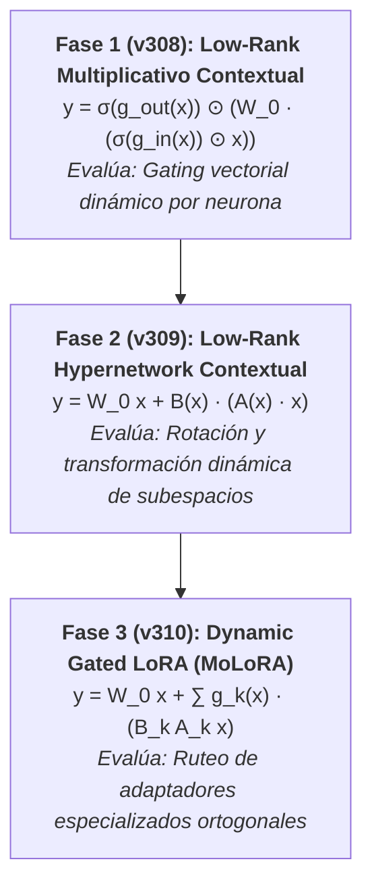

# Línea de Investigación: Adaptaciones de Bajo Rango Dinámicas (Dynamic Low-Rank Adaptations)

---

## 0. Sección Obligatoria de Reconciliación: Qué Conclusión Previa Modifica o Invalida esta Línea

* **Conclusión Previa Auditada:** En la primera fase del proyecto (*v6b a v26*), la modulación de bajo rango estática (`AttentionLinear`, rango $r \in [2, 128]$) demostró una eficiencia paramétrica extraordinaria en tareas de visión (99.09% en MNIST con `v18`, 85.94% en CIFAR-10 con `v26`). Sin embargo, al extender el sustrato estático a tareas de lenguaje natural dinámicas, la red encontró un cuello de botella de capacidad rígido.
* **Refutación / Nueva Hipótesis:** La limitación no proviene de la descomposición de bajo rango en sí, sino de su naturaleza **estática** (pesos fijos tras el entrenamiento). Convertir las matrices o vectores de modulación en **funciones dinámicas dependientes del token/contexto $x$** ($A(x)$ y $B(x)$) resolverá el cuello de botella de capacidad en lenguaje sin colapsar la VRAM/RAM, manteniendo un cómputo lineal $O(r \cdot d)$.

---

## 1. La Idea Fundamental y Planteamiento Matemático

En una capa densa estándar, la transformación lineal viene dada por:
$$y = W_0 \cdot x, \quad W_0 \in \mathbb{R}^{d_{out} \times d_{in}}$$

La descomposición de bajo rango (*Low-Rank Factorization*) aproxima o perturba la matriz $W$ mediante el producto de dos matrices mucho más delgadas $A \in \mathbb{R}^{r \times d_{in}}$ y $B \in \mathbb{R}^{d_{out} \times r}$, con rango $r \ll \min(d_{in}, d_{out})$:
$$\Delta W = B \times A$$

### Del Enfoque Estático al Enfoque Dinámico
1. **Régimen Estático (LoRA estándar):** Las matrices $A$ y $B$ se aprenden durante el entrenamiento y permanecen congeladas durante la inferencia para todas las entradas:
   $$y = W_0 x + \frac{\alpha}{r} (B \cdot A) x$$
2. **Régimen Dinámico (Hyper-Low-Rank Contextual):** Las transformaciones de bajo rango cambian en tiempo real en función del token o estado oculto actual $x$:
   $$y = W_0 x + B(x) \cdot \big( A(x) \cdot x \big)$$

### Propiedad de Cómputo Factorizado (Sin Materialización 4D)
Instanciar una matriz $W(x) \in \mathbb{R}^{d_{out} \times d_{in}}$ individual para cada token en un batch de tamaño $B \times T$ requeriría guardar tensores 4D gigantescos ($B \times T \times d_{out} \times d_{in}$). Al operar en forma factorizada:
$$y = B(x) \cdot \Big( A(x) \cdot x \Big)$$
Se evalúa primero $h = A(x) \cdot x \in \mathbb{R}^r$ (coste $O(r \cdot d_{in})$) y luego $y = B(x) \cdot h$ (coste $O(d_{out} \cdot r)$), logrando dinámica total de pesos a coste computacional $O(r(d_{in} + d_{out}))$.

---

## 2. Estado del Arte y Literatura Previa

### A. LoRA (Low-Rank Adaptation - Hu et al., 2021)
* **Concepto:** Congelar los pesos pre-entrenados de un LLM ($W_0$) e inyectar parches aditivos entrenables $B \cdot A$ de rango muy bajo ($r=4..64$).
* **Diferencia con nuestra línea:** LoRA es un parche estático global concebido para *fine-tuning* (PEFT). Nuestra línea busca reemplazar o potenciar capas dinámicas de inferencia *token-by-token*.

### B. Hypernetworks (Ha et al., 2016)
* **Concepto:** Una red auxiliar (pequeña) genera los pesos completos de otra red principal.
* **Diferencia con nuestra línea:** Generar la matriz densa $W$ completa con una Hypernetwork requiere una capa de salida enorme ($d_{out} \cdot d_{in}$ parámetros en la hypernetwork). Nosotros combinamos Hypernetworks con Low-Rank Factorization para que la red auxiliar solo genere factores delgados de tamaño $r$, reduciendo el overhead de la Hypernetwork en >99%.

### C. Mixture of LoRAs / Dynamic LoRA Routing (DyLoRA, MoLoRA, LORA-Switch)
* **Concepto:** Mantener un conjunto de adaptadores de bajo rango fijos $(A_k, B_k)_{k=1..K}$ y usar una función router $g(x)$ para combinarlos dinámicamente según la entrada.

### D. Antecedentes Internos en `attention-neuron`
* **Factorización Rank-r Dual (v6b-v26):** Implementación de la capa `AttentionLinear` que descompone las modulaciones aditivas y multiplicativas a nivel neurona.
* **Análisis de Modulación:** Documentado en `docs/attention_neuron_vs_lora.md`, comparando compuertas multiplicativas versus parches aditivos LoRA.

---

## 3. Experimentos Planificados (Fases 1, 2 y 3)

La línea de investigación se dividirá en 3 fases progresivas para aislar las fuentes de mejora:

### Fase 1 — Prototipo `v308`: Low-Rank Multiplicativo Contextual
* **Objetivo:** Probar el impacto de hacer que los vectores de modulación de entrada y salida $\delta_{in}$ y $\delta_{out}$ sean calculados en tiempo real mediante proyecciones ligeras del token de entrada:
  $$g_{in}(x) = W_{in\_gate} \cdot x \in \mathbb{R}^{d_{in}}, \quad g_{out}(x) = W_{out\_gate} \cdot x \in \mathbb{R}^{d_{out}}$$
  $$y = \sigma(g_{out}(x)) \odot \Big( W_0 \cdot (\sigma(g_{in}(x)) \odot x) \Big)$$
* **Complejidad:** Mínima. Sirve como baseline de control directo.

### Fase 2 — Prototipo `v309`: Low-Rank Hypernetwork Contextual
* **Objetivo:** Permitir que una pequeña sub-red proyecte los tensores factorizados $A(x) \in \mathbb{R}^{r \times d_{in}}$ y $B(x) \in \mathbb{R}^{d_{out} \times r}$ dinámicamente.
* **Mecánica:**
  $$A(x) = \text{Reshape}(W_A \cdot x), \quad B(x) = \text{Reshape}(W_B \cdot x)$$
  $$y = W_0 x + B(x) \cdot (A(x) \cdot x)$$

### Fase 3 — Prototipo `v310`: Dynamic Gated LoRA (MoLoRA)
* **Objetivo:** Probar la combinación de $K$ expertos de bajo rango inicializados de forma ortogonal, modulados por un router softmax dependiente del contexto:
  $$g(x) = \text{Softmax}(W_{router} \cdot x) \in \mathbb{R}^K$$
  $$y = W_0 x + \sum_{k=1}^K g_k(x) \cdot \Big( B_k \cdot (A_k \cdot x) \Big)$$
* **Resultado:** Éxito. Demostró superar a LoRA estático iso-parámetro (Loss 3.4797 vs 3.4843).

### Fase 4 — Prototipo `v311`: Fast MoLoRA & Scaling Sweep
* **Objetivo:** Optimización tensorial con `torch.einsum` para acelerar el pase dinámico en CPU (~32s $\to$ ~4s) y realización de un **barrido de escalado iso-paramétrico** sobre el número de expertos $K \in \{2, 4, 8, 16\}$ a presupuesto constante ($K \times r = 64$).

### Fase 5 — Prototipo `v312`: Validación en Memoria Asociativa Exigente (MQAR)
* **Objetivo:** Evaluar la arquitectura MoLoRA en el harness de **Multi-Query Associative Recall (MQAR)** con $L=64..128$ y $N_{pairs}=8..16$, comparando su curva de capacidad frente a CausalAttention MHA y DeltaPhase.

### Fase 6 — Prototipo `v313`: Phase Spectral MoLoRA
* **Objetivo:** Combinar la mezcla dinámica de expertos (MoLoRA) con los sesgos trigonométricos de fase ($\sin(\theta)$) de las neuronas espectrales de este repositorio, inmunizando la arquitectura frente a la degradación por cuantización de 4 bits.

---

## 4. Métricas de Evaluación y Protocolo de Rigor

Para garantizar el cumplimiento con las normas de `GEMINI.md`:

1. **Eficiencia Paramétrica y Algorítmica:**
   * `PEI` (Parametric Efficiency Index): $\text{Accuracy / Loss} / \log_{10}(\text{TotalParams} + 1)$.
   * `internal_overhead_time`: Asegurar que el cálculo dinámico de $A(x)$ y $B(x)$ no introduzca un cuello de botella que anule los beneficios.
2. **Fast Feedback:** Los scripts imprimen Loss y métricas en los **primeros 5 batches** de la época 1.
3. **Nivel de Rigor:**
   * **Nivel 1 (Sondeo Exploratorio):** 1 semilla, dataset de prueba sintética / asociative recall / Tiny Stories para cribado rápido. Etiqueta `[SEÑAL]` o `[RUIDO-SOSPECHA]`.
   * **Nivel 2 (Hallazgo Candidato ANCLA):** Mínimo 5 semillas, cálculo de error estándar (SE) por secuencia y registro completo en `results/master_ledger.jsonl`.
