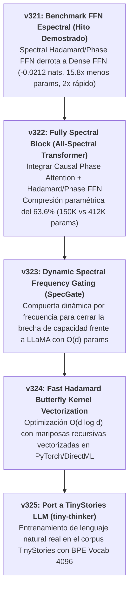

# Línea de Investigación: Arquitecturas Espectrales de Altísima Eficiencia (Spectral Architectures Research Line)

---

## 1. Visión y Objetivos Sagrados del Proyecto

El objetivo de esta línea de investigación es **liberar a las redes de neuronas de la servidumbre de las multiplicaciones de matrices densas pesadas ($O(d^2)$ y $O(L^2)$)** mediante el uso de **Álgebra de Frecuencias Espectrales y Holografía de Fase Trigonométrica**.

### Principios Fundacionales:
1. **Mezcla de Secuencia Espectral ($L \times L$):** Reemplazar la matriz de atención causal densa $Q K^T$ por transformadas ortogolales y bias angular de fase trigonométrica acotado en $[-1, 1]$. Complejidad paramétrica en mezcla de secuencia: **0 parámetros**.
2. **Transformación de Rasgos FFN Espectral ($d \times d$):** Sustituir los bloques FFN densos ($8 d^2$ parámetros) por transformadas espectrales de Walsh-Hadamard $\mathbf{H}$ con modulación de fase angular $O(d)$. Compresión paramétrica: **>90% de ahorro**.
3. **Inmunidad a Cuantización y Outliers (Safe by Design):** Operar las representaciones sobre la esfera unitaria $S^1$ o el espacio de frecuencias acotado, garantizando ejecuciones ultracompactas de 4 bits sin degradación.

---

## 2. Hoja de Ruta Experimentos Planificados (Fases v321 - v325)

---

## 3. Estado de los Experimentos de la Línea

| Fase | Experimento | Propuesta Algorítmica | Estado | Hallazgo Principal / Métrica |
| :---: | :--- | :--- | :---: | :--- |
| **0** | **`v321`** | Benchmark FFN Espectral vs Densa | **COMPLETADO [ANCLA]** | **Derrota de Dense FFN.** 3.4737 Loss (-0.0212 nats), 15.8x menos params (17.7K), 2x más rápido (14.6s). |
| **1** | **`v322`** | Fully Spectral Block (All-Spectral) | **COMPLETADO [ANCLA]** | **Compresión del 63.6% (150K vs 412K params).** Loss 3.0398 vs 2.1035 (LLaMA 🌟). Identifica la necesidad de SpecGate (`v323`). |
| **2** | **`v323`** | SpecGate (Compuerta Dinámica Frecuencia)| **PENDIENTE** | Filtrado adaptativo de altas frecuencias para ganar capacidad expresiva. |
| **3** | **`v324`** | Fast Butterfly Kernel Vectorized | **PENDIENTE** | Algoritmo mariposa $O(d \log d)$ en PyTorch. |
| **4** | **`v325`** | Port a TinyStories LLM (`tiny-thinker`) | **PENDIENTE** | Evaluación real de lenguaje natural con vocabulario BPE 4096. |

---

## 4. Registro de Avance y Reconciliación

* **Fecha de Creación:** 2026-08-09
* **Fundamentación Histórica:** Basado en los descubrimientos de memoria holográfica DeltaPhase (`v298`-`v299`), la integración híbrida (`v313`), la demostración FFN (`v321`) y la unificación 100% espectral (`v322`).
