# Línea de Investigación: Arquitecturas Espectrales de Altísima Eficiencia (Spectral Architectures Research Line)

---

## 1. Visión y Objetivos Sagrados del Proyecto

El objetivo de esta línea de investigación es **liberar a las redes de neuronas de la servidumbre de las multiplicaciones de matrices densas pesadas ($O(d^2)$ y $O(L^2)$)** mediante el uso de **Álgebra de Frecuencias Espectrales, Transformadas Ortogonales y Holografía de Fase Trigonométrica**.

### Principios Fundacionales:
1. **Mezcla de Secuencia Causal ($L \times L$):** Utilizar atención causal ligera con bias de fase trigonométrico angular $[-1, 1]$ para enrutamiento asociativo dinámico de tiempo.
2. **Transformación de Rasgos FFN Espectral ($d \times d$):** Sustituir los bloques FFN densos pesados ($8 d^2$ parámetros) por transformadas espectrales ortogonales (FWHT / DCT-II / DWT Haar) moduladas por fase trigonométrica de $O(d)$ parámetros y sintonizadas dinámicamente mediante un **Lerp Router aprendible**. Compresión paramétrica: **>90% de ahorro en rasgos**.
3. **Inmunidad a Cuantización y Outliers (Safe by Design):** Operar las representaciones sobre la esfera unitaria $S^{d-1}$ o el espacio de frecuencias acotado, garantizando ejecuciones ultracompactas de 4 bits sin degradación.

---

## 2. Hoja de Ruta Consolidada de Experimentos (Fases v321 - v330)

```mermaid
graph TD
    v321["<b>v321: Benchmark FFN Espectral vs Densa</b><br/>FFN Espectral Hadamard/Phase derrota a FFN Densa (-0.0212 nats, 15.8x menos params, 2x más rápida)"] --> v322b["<b>v322b: Iso-Parameter All-Spectral Transformer</b><br/>0.0807 Loss vs 2.1035 (LLaMA) | PEI 2.1229 (+2400% eficiencia)"]
    v322b --> v323["<b>v323: SpecGate Dynamic Frequency Gating</b><br/>43.7% esparcidad frecuencial (1.0463 Loss vs 2.1035 LLaMA)"]
    v323 --> v324["<b>v324: Fast Hadamard Butterfly Kernel O(d log d)</b><br/>Equivalencia numérica idéntica (< 1e-5 error), 0 bytes buffer"]
    v324 --> v325["<b>v325: Barrido de Escalado Iso-Paramétrico (150K a 1.1M Params)</b><br/>Fully Spectral DERROTÓ A LLAMA EN LAS 4 ESCALAS PARAMÉTRICAS"]
    v325 --> v326b["<b>v326b: Benchmark de Bases Espectrales en 25 ÉPOCAS</b><br/>FWHT CAMPEONA ABSOLUTA (99.92% Acc, 0.0047 Loss, PEI 36.67)<br/>DWT Haar SUBCAMPEONA (99.91% Acc, 0.0066 Loss, PEI 26.14)"]
    v326b --> v327["<b>v327: Fusión Tri-Espectral (FWHT + DCT + Haar)</b><br/>99.76% Acc (0.0155 Loss) a 15 épocas (Supera a bases individuales)"]
    v327 --> v328["<b>v328: Learnable Substrate Lerp Gating & Selection Report</b><br/>99.79% Acc con -38% parámetros (526K). Preferencia por DCT-II en Capa Final (38.25%)"]
    v328 --> v329["<b>v329: SpecAttention 2D Attention-Free vs MHA</b><br/>Certifica que la Atención Causal MHA en secuencia es indispensable (99.74% vs 62.22% Acc)"]
    v329 --> v330["<b>v330: Port a TinyStories LLM en tiny-thinker</b><br/>Entrenamiento de lenguaje natural real en el corpus TinyStories con BPE Vocab 4096"]
```



---

## 3. Estado de los Experimentos de la Línea

| Fase | Experimento | Propuesta Algorítmica | Estado | Hallazgo Principal / Métrica |
| :---: | :--- | :--- | :---: | :--- |
| **0** | **`v321`** | Benchmark FFN Espectral vs Densa | **COMPLETADO [ANCLA]** | **Derrota de Dense FFN.** 3.4737 Loss (-0.0212 nats), 15.8x menos params (17.7K), 2x más rápido (14.6s). |
| **1** | **`v322`** | Fully Spectral Block (All-Spectral) | **COMPLETADO [ANCLA]** | Compresión del 63.6% (150K vs 412K params). Identifica la necesidad de profundizar la vía espectral. |
| **1b** | **`v322b`** | Iso-Parameter All-Spectral Transformer | **COMPLETADO [ANCLA - HITO ABSOLUTO]** | **COLAPSO TOTAL DE LOSS (0.0807 vs 2.1035 LLaMA).** PEI 2.1229 (+2,400% de eficiencia paramétrica). |
| **2** | **`v323`** | SpecGate (Compuerta Dinámica Frecuencia)| **COMPLETADO [ANCLA]** | **43.7% Esparcidad Frecuencial.** Loss 1.0463 (doble de precisa que LLaMA 2.1035) apagando casi la mitad de armónicos. |
| **3** | **`v324`** | Fast Butterfly Kernel Vectorized | **COMPLETADO [ANCLA]** | **Equivalencia Numérica Exacta (< 1e-5 error).** 18.2x menos operaciones aritméticas teóricas (896 vs 16K ops) y 0 bytes buffer. |
| **4** | **`v325`** | Barrido Escalado Iso-Parámetros | **COMPLETADO [ANCLA - HITO DE ESCALADO]**| **DERROTA DE LLAMA EN LAS 4 ESCALAS.** 150K (25% vs 13%), 280K (47% vs 27%), 680K (96% vs 73%), 1.1M (**98.41% vs 93.32% Acc**). |
| **5** | **`v326b`** | Benchmark Espectral en 25 ÉPOCAS | **COMPLETADO [ANCLA - HITO DE PERFECCIÓN]**| **FWHT GANADORA ABSOLUTA (99.92% Acc, 0.0047 Loss, PEI 36.67).** DWT Haar (99.91% Acc, PEI 26.14). DCT-II (99.63% Acc). |
| **6** | **`v327`** | Fusión Tri-Espectral (FWHT+DCT+Haar) | **COMPLETADO [ANCLA]** | **99.76% Acc (0.0155 Loss, PEI 10.86).** Supera a todas las bases individuales a 15 épocas. |
| **7** | **`v328`** | Learnable Substrate Lerp Router | **COMPLETADO [ANCLA - HITO DE REPORTE]**| **99.79% Acc (0.0188 Loss) con 38% menos parámetros (526K).** DCT-II domina la capa final (38.25%). |
| **8** | **`v329`** | SpecAttention 2D Attention-Free | **COMPLETADO [ANCLA - CERTIFICACIÓN]**| **Atención Causal MHA es Indispensable en Secuencia (99.74% vs 62.22% Acc).** Define la arquitectura definitiva v328. |
| **9** | **`v330`** | Port a TinyStories LLM (`tiny-thinker`) | **PENDIENTE** | Evaluación real de lenguaje natural con vocabulario BPE 4096. |

---

## 4. Análisis de Síntesis Ejecutiva y Lecciones Clave

### 1. Las Redes Espectrales Matan a las Capas Densas Tradicionales
* Reemplazar las matrices densas pesadas $8 d^2$ del FFN por proyecciones espectrales ortogonales moduladas por fase trigonométrica de $O(d)$ parámetros reduce los parámetros en un **93.7%** y **duplica la velocidad de entrenamiento en CPU**.
* A igual presupuesto paramétrico (`v325`), la arquitectura espectral **DERROTÓ A LLAMA EN LAS 4 ESCALAS PARAMÉTRICAS** (150K, 280K, 680K y 1.1M params), alcanzando un récord de **98.41% Acc vs 93.32% de LLaMA** a 1.1M params.
* En 25 épocas completas (`v326b`), la base ortogonal binaria **FWHT alcanzó la perfección de 99.92% Acc (0.0047 Loss, PEI 36.6741)** y las ondículas **DWT Haar alcanzaron 99.91% Acc**.

### 2. Sintonización Dinámica de Sustratos Espectrales (`v327`, `v328`)
* **Router Lerp Aprendible (`v328`):** Combinar FWHT, DCT-II y Haar mediante pesos $Softmax(\alpha)$ aprendibles por capa logró **99.79% Acc ahorrando un 38% de parámetros (526K params)**.
* **Especialización Jerárquica:** El reporte transparente por capa demostró que las capas intermedias equilibran FWHT binaria (~36%) y DCT-II de cosenos (~36%), mientras que la **capa final de salida exige una preferencia dominante por DCT-II (38.25%)** para proyectar suavemente la distribución del vocabulario.

### 3. Delimitación entre Secuencia y Características (`v329`)
* La atención causal $QK^T$ (con bias de fase) en la dimensión de tiempo ($L$) es **indispensable para el enrutamiento asociativo dinámico de secuencias** (99.74% vs 62.22% sin atención).
* Por lo tanto, la arquitectura óptima es la **Híbrida Causal-Espectral (`v328`)**: Mezcla temporal dinámica mediante Atención Causal MHA + Mezcla de características ultra-eficiente mediante FFN Espectral Lerp Router.

---

## 5. Especificación del Motor Definitivo para el LLM Real (`tiny-thinker`)

```
[Entrada Tokens (Vocab BPE 4096)] 
       │
       ▼
┌─────────────────────────────────────────────────────────┐
│ Bloque Causal Sequence: Atención Causal MHA Ligera      │ ──> Enrutamiento asociativo dinámico de tiempo
└─────────────────────────────────────────────────────────┘
       │
       ▼
┌─────────────────────────────────────────────────────────┐
│ Bloque Feature FFN: Lerp Router (FWHT + DCT-II + Haar)  │ ──> Compresión espectral >90% en rasgos
└─────────────────────────────────────────────────────────┘
       │
       ▼
[Salida Vocabulario BPE (Dominada por DCT-II Armónica)]
```

---

## 6. Registro de Avance y Reconciliación

* **Fecha de Creación:** 2026-08-09
* **Última Actualización:** 2026-08-10
* **Fundamentación Histórica:** Basado en los descubrimientos de memoria holográfica DeltaPhase (`v298`-`v299`), la integración híbrida (`v313`), la demostración FFN (`v321`), la unificación 100% espectral (`v322`), la certificación iso-paramétrica (`v322b`), el filtrado SpecGate (`v323`), el kernel mariposa FHT (`v324`), el barrido iso-paramétrico (`v325`), la fusión tri-espectral (`v327`), el router aprendible de sustratos espectrales (`v328`) y la certificación de la necesidad de atención causal en secuencia (`v329`).


---

# REVISIÓN GPT 5.6 Earth

---

# Línea de investigación: arquitecturas espectrales

> **Última actualización:** 2026-08-11. Este documento distingue resultados sintéticos, controles causales y evidencia en lenguaje real. No usa resultados de una tarea sintética como prueba de superioridad en LLMs.

## 1. Hipótesis y estado actual

La hipótesis útil no es «las bases espectrales sustituyen universalmente a las capas densas». Es más específica: una parametrización espectral restringida puede aportar compresión, coste algorítmico potencial o eficiencia muestral cuando coincide con la estructura de la tarea. Cada parte requiere controles independientes.

| Afirmación | Estado | Evidencia relevante |
| :--- | :--- | :--- |
| FWHT/DCT mejora a Dense en lenguaje real pequeño | [RUIDO-SOSPECHA] | v330b: Dense es nominalmente mejor y más rápido; v331 no distingue FWHT+DCT de RandomPair iso-arquitectura. |
| Una base espectral concreta supera a una rotación aleatoria | [RUIDO-SOSPECHA] | v331: `FWHT+DCT − RandomPair=-0.00137`, `2×SE=0.00893`. |
| La compresión espectral puede ser eficiente cuando la base coincide con el target | [SEÑAL] condicionada | v332 teacher–student: base coincidente llega al suelo de ruido con 64 parámetros y pocos ejemplos; el control aleatorio invierte el efecto. |
| El denso tiene capacidad para targets no diagonales en la base | [SEÑAL] | v332 `dense_full`: Dense ≈0.00507 a n=128; diagonales ≈1.00. |
| Un kernel FWHT puede reducir operaciones teóricas | [SEÑAL de implementación] | Requiere benchmark de kernel compilado; las matrices materializadas PyTorch/CPU no prueban ventaja de wall-clock. |

## 2. Reconciliación de la serie v321–v332b

Resultados anteriores v321–v329 proceden en gran parte de harnesses sintéticos con objetivos locales, controles incompletos o presupuestos no equivalentes. Sus métricas no se deben promocionar a [ANCLA] de arquitectura general. v330/v331 introducen texto real, split temporal, test retenido y control ortogonal aleatorio; delimitan negativamente la afirmación fuerte de superioridad espectral general.

v332 no revierte esa delimitación: demuestra en un teacher lineal construido que el sesgo inductivo coincidente reduce muestras y bits. v332b añade que Dense presenta un pico de interpolación cerca de $n=d$ sensible a ridge; no convierte ese pico en una derrota general de Dense.

## 3. Evidencia cuantitativa actual

| Experimento | Resultado que debe citarse | Límite |
| :--- | :--- | :--- |
| v330b | Dense 1.95392; Lerp FWHT+DCT 1.95631; diferencia no distinguible | Tiny Shakespeare char, 2 bloques, 30 épocas; Lerp 37.9% más lento. |
| v331 | FWHT+DCT–RandomPair `-0.00137 ± 0.00446` | No atribuye efecto a bases; cinco semillas. |
| v332 | Teacher DCT: DCT 0.00252, Dense 0.00510, Random 0.07931 a n=128 | Teacher favorable construido; regresión lineal. |
| v332 | Teacher aleatorio: Random 0.00252, DCT 0.07909 | Control de simetría, no ventaja intrínseca DCT. |
| v332 | Teacher denso: Dense 0.00507, diagonales ≈1.00 | Muestra frontera de capacidad. |
| v332b | Pico Dense en n=64 mitigado por ridge | Auditoría de regularización, no benchmark de LLM. |
| v333 | Expansión DCT/Random top-K alcanza Dense exactamente a K=$d^2$; K bajo sólo sirve con teacher compresible en la base | Matrices lineales sintéticas y forward materializado; cuantización global 4-bit se degrada al subir K. |

## 4. Dirección de investigación defendible

1. Buscar tareas o representaciones con estructura espectral medible antes de imponer una base fija.
2. Tratar la base (DCT, FWHT, aleatoria) como hipótesis a controlar, no como dogma.
3. Medir coste con kernels compilados y la misma salida funcional antes de hacer claims de eficiencia.
4. Para lenguaje, priorizar bases/adaptadores condicionados por datos, selección por validación y replicación en tokenización BPE real.
5. Reportar siempre clase funcional, parámetros, código/bits, coste y controles aleatorios; «menor volumen VC con igual representación universal» no es una afirmación válida.
6. Tratar $K$ como presupuesto de capacidad: medir curvas rate–distortion y cuantización por bandas antes de declarar una compresión útil.

## 5. Próximo criterio de avance

Sólo promover una variante espectral en lenguaje si mejora a Dense y a un control ortogonal aleatorio iso-arquitectura, con `|Δ| ≥ 2×SE`, en al menos un corpus/tokenizador real adicional y sin empeorar el coste medido. Si se persigue eficiencia muestral, formular primero una predicción de estructura de base y comprobar el control de simetría equivalente a v332.


---

# SINTESIS GPT-5.6

---


Las representaciones espectrales no son una alternativa universalmente mejor a las densas. Son un sesgo inductivo: apuestan a que la transformación útil es simple en una base concreta.

En corto:

| Aspecto | Espectral fija/modulada | Densa |
|---|---|---|
| Parámetros | Muy pocos: típicamente \(O(d)\) ganancias | Muchos: \(O(d^2)\) pesos |
| Mejor caso | El problema es aproximadamente diagonal o disperso en su base | El problema requiere una transformación arbitraria |
| Muestras necesarias | Menos, si la base coincide con la estructura | Más en regímenes submuestreados |
| Capacidad universal | Limitada: no representa cualquier matriz | Alta: representa cualquier transformación lineal |
| Cuantización / descripción | Muy compacta | Más costosa en bits |
| Coste real actual | No necesariamente menor con matrices materializadas | Suele ser más rápido en PyTorch/CPU |
| Riesgo | Elegir la base equivocada introduce sesgo fuerte | Sobreajuste o pico de interpolación con pocos datos |

La intuición: una capa densa aprende “cualquier rotación y cualquier mezcla”. Una espectral fija dice: “primero miro el problema en DCT/FWHT y sólo aprendo cuánto amplificar cada modo”. Es mucho más barato, pero sólo funciona si esa coordenada revela una estructura real.

Lo que vimos:

- En v332, cuando el teacher era DCT-disperso, la diagonal DCT llegó al ruido con 64 parámetros y muy pocas muestras; Dense necesitó más datos y 4,096 parámetros.
- Al rotar el teacher a una base aleatoria, ganó la diagonal aleatoria, no DCT. Eso prueba que el beneficio es coincidencia base–tarea, no magia de DCT.
- Con un teacher denso completo, Dense ganó y las diagonales fallaron: la restricción espectral pierde capacidad.
- En Tiny Shakespeare real, v330/v331 no mostraron que FWHT/DCT ganen a Dense ni a controles aleatorios equivalentes. Dense además fue más rápido en la implementación actual.

La formulación más honesta es:

> Las representaciones espectrales son excelentes compresores y regularizadores estructurados cuando la tarea tiene una base aproximadamente adecuada; las densas siguen siendo la opción robusta cuando no conocemos esa estructura o necesitamos máxima expresividad.

El siguiente salto interesante no es reemplazar FFNs por DCT fija, sino aprender o seleccionar una base condicionada por datos —sin perder los controles aleatorios y de coste.


---

# FEEDBACK A OBJECIONES DEL USUARIO

---


Tienes razón en la corrección central: mi resumen mezcló dos cosas distintas.

Una representación espectral puede aproximar —e, incluso, representar exactamente— una matriz densa si aumentas suficientemente su presupuesto. No hay magia que permita representar una matriz genérica de \(d\times d\) con menos de \(O(d^2)\) grados de libertad sin asumir estructura; pero sí puedes recorrer un continuo entre compresión fuerte y equivalencia densa.

\[
W \approx \sum_{r=1}^{k} U_r^\top \operatorname{diag}(a_r) V_r
\]

Con bases fijas, cada término aporta \(O(d)\) coeficientes. Si \(k\ll d\), comprimes; si aumentas \(k\) hasta tener un diccionario que cubra el espacio matricial, recuperas capacidad densa. Esa es la analogía correcta con JPEG: no es “DCT no puede representar el BMP”, sino “si el contenido es estructurado, pocos coeficientes bastan; si no, necesitas muchos y acabas cerca del BMP”.

La precisión importante es que v332 probó sólo el caso extremo de **un operador diagonal en una base fija**:

\[
W=U^\top\operatorname{diag}(a)U.
\]

Eso tiene sólo \(d\) grados de libertad y no puede representar una matriz genérica. No prueba que una arquitectura espectral con \(k\) modos, varias ramas, factorizaciones o bases aprendidas no pueda hacerlo.

Sobre tus objeciones:

- Sí: que DCT no memorice una transformación que es simple en una base aleatoria puede ser una **ventaja de regularización**. v332 precisamente ilustra eso. Una base equivocada rechaza estructura ajena y no gasta capacidad en ella.

- La finalidad del teacher aleatorio no era decir que DCT falla ante “ruido”, sino comprobar simetría: si construyo una señal compacta en una base aleatoria, debe ganar esa base aleatoria. Así evitamos confundir “prior compacto correcto” con una supuesta propiedad mística de DCT.

- Cuando dije que Dense “ganó” en el teacher denso, sólo significa: tuvo menor MSE sobre datos de test al reconstruir una transformación generada como matriz plena. La diagonal espectral no era capaz de representarla con sus 64 coeficientes. No es una victoria filosófica de Dense; es la frontera esperable del ajuste más comprimido.

Y sí: el lenguaje no es aleatorio. Pero hay una sutileza grande: en v330/v331, DCT/FWHT se aplicaban sobre las **coordenadas ocultas** de un Transformer. Esas coordenadas no son píxeles, ni posiciones temporales, ni frecuencias lingüísticas intrínsecas: pueden rotarse sin cambiar la representación. Que el lenguaje tenga estructura no implica automáticamente que una DCT sobre los canales ocultos de un modelo concreto sea la base correcta.

Tu argumento de escala es justo el argumento fuerte a favor de explorarlo:

- Matriz densa \(10^6\times10^6\): \(10^{12}\) pesos; ~2 TB en fp16, ~4 TB en fp32, y ~\(10^{12}\) MACs por vector.
- Una transformada tipo FWHT con \(d=10^6\): aproximadamente \(d\log_2d\approx20\) millones de operaciones, más \(O(kd)\) si introduces \(k\) modulaciones/rangos.
- Con kernels reales, ahí hay una diferencia de régimen, no un ajuste menor.

La tesis más fuerte y defendible sería:

> Un operador espectral de complejidad graduable puede ofrecer una curva capacidad–coste mucho mejor que una matriz densa cuando la transformación aprendida es compresible en una familia de bases adecuada. Al aumentar \(k\), puede aproximar progresivamente la expresividad densa; el objetivo es encontrar el punto de la curva antes de pagar \(O(d^2)\).

Eso sugiere un experimento mejor que v332: barrer \(k\) —número de modos, átomos o ramas espectrales— frente a una matriz densa, y medir loss, bits, latencia y estabilidad. No “espectral contra Dense” como categorías binarias, sino la curva de rate–distortion–compute.

---
