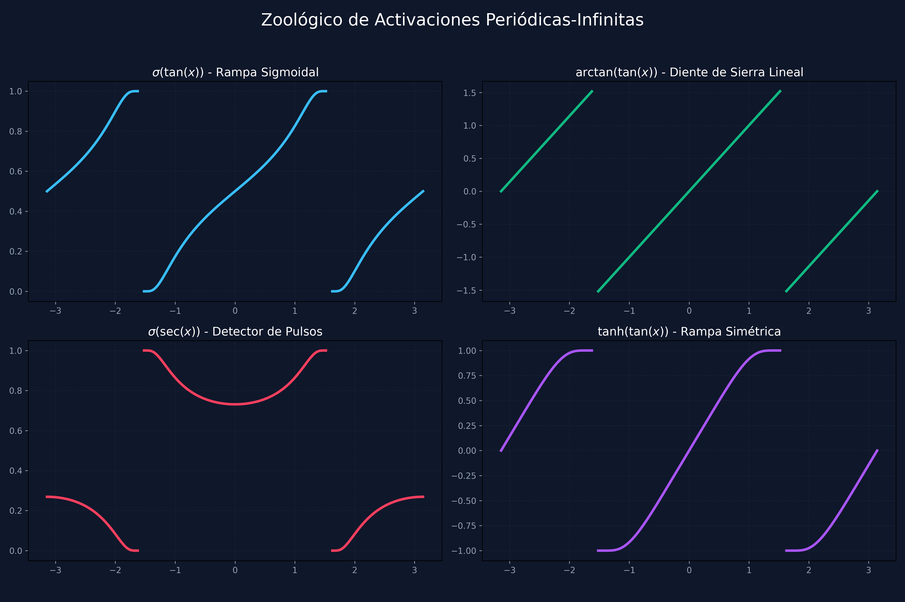
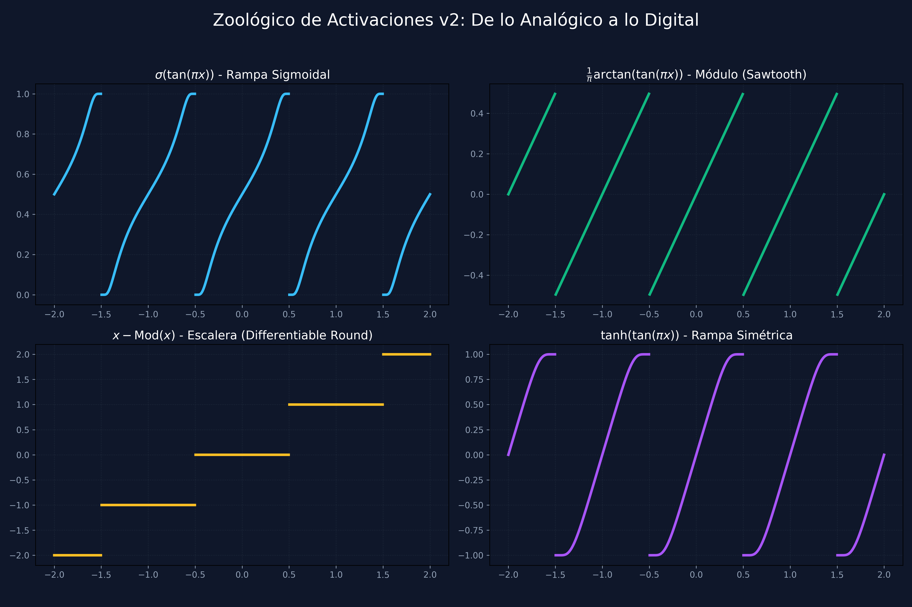

# Hallazgos: Zoológico de Activaciones Periódicas-Infinitas

## Introducción
Tras el éxito de la rampa sigmoidal periódica, exploramos otras combinaciones de funciones periódicas divergentes y funciones de confinamiento (squashing). Cada combinación ofrece una topología única para el aprendizaje de ritmos y patrones espectrales.

## Comparativa Visual

## Análisis de Especies

### 1. La Rampa Lineal: $\arctan(\tan(x))$
*   **Comportamiento:** Un "Sawtooth" perfecto.
*   **Ventaja:** Gradiente constante ($=1$). No sufre de saturación. Es la forma más pura de inyectar aritmética de módulos en una red.
*   **Uso ideal:** Regresión matemática y cálculo de índices de memoria circular.

### 2. El Detector de Pulsos: $\sigma(\sec(x))$
*   **Comportamiento:** Picos periódicos extremadamente agudos.
*   **Ventaja:** Funciona como un **filtro de coincidencia**. La neurona solo "despierta" cuando la señal de entrada está en una fase muy específica.
*   **Uso ideal:** Detección de anomalías periódicas o sincronización de relojes internos en arquitecturas recurrentes.

### 3. La Escalera Diferenciable: $x - \text{Mod}(x)$
*   **Comportamiento:** Una serie de escalones planos con subidas rápidas.
*   **Ventaja:** Permite simular la función `round()` o `floor()` de forma que el gradiente pueda fluir. La red puede aprender a "cuantizar" sus propios valores.
*   **Uso ideal:** Direccionamiento de memoria (Indexing), aprendizaje de constantes enteras y compresión de pesos (Quantization).

El problema de round(x) es que su gradiente es cero en todas partes y NaN en los saltos. Si una red intenta aprender a "redondear", se queda ciega.

Pero, usando lo que acabamos de descubrir con la tangente, podemos crear una "Escalera Diferenciable".

El "Soft Round" mediante Tangente
Sabemos que $x - (x \pmod 1)$ nos da la parte entera. Si sustituimos el módulo por nuestra versión periódica $\arctan(\tan(\dots))$, obtenemos una función que:

Tiene mesetas horizontales (como un redondeo).
Tiene gradiente en las subidas, lo que permite que la red "empuje" un valor de un escalón a otro durante el entrenamiento.

### 4. La Rampa Bipolar: $\tanh(\tan(x))$
*   **Comportamiento:** Una rampa sigmoidal que va de $-1$ a $1$.
*   **Ventaja:** Centrada en cero. Facilita la estabilidad numérica en redes con muchas capas.
*   **Uso ideal:** Sustituto directo de capas densas en arquitecturas espectrales profundas.

## Conclusión
No existe una "mejor" función. La elección depende de la naturaleza del problema:
*   Si buscas **precisión aritmética**, usa el Arcotangente.
*   Si buscas **especialización de fase**, usa la Secante.
*   Si buscas **estabilidad en clasificación**, usa el Sigmoide o Tanh.

Estas funciones abren una nueva dimensión de **Diseño Topológico de Activaciones** que apenas estamos empezando a explorar.
