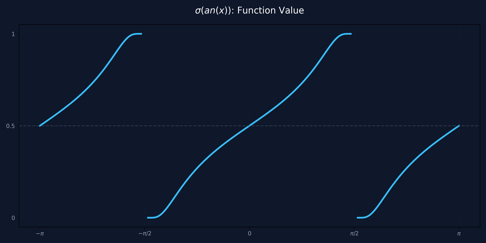
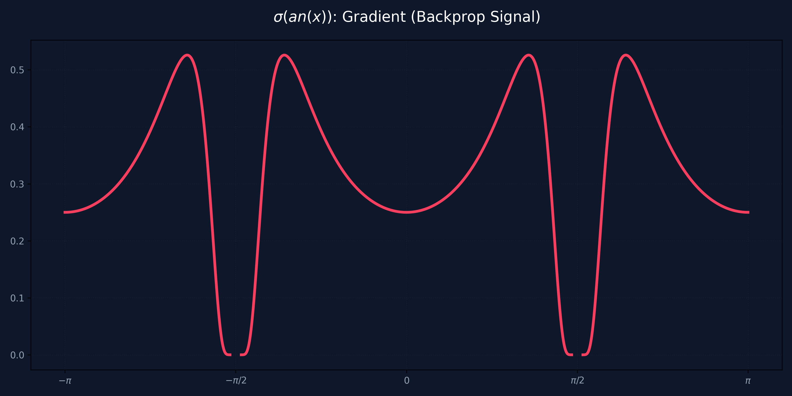

# Hallazgos: La Rampa Sigmoidal Periódica $\sigma(\tan(x))$

## Contexto e Hipótesis
Durante la investigación sobre **Attention Neurons** y codificación de fase, surgió la pregunta de qué sucede al componer una función de crecimiento infinito periódico ($\tan$) con una función de saturación ($\sigma$). La hipótesis es que esto genera un mapeo determinista de fases infinitas a un rango acotado $[0, 1]$, ideal para sistemas de atención resonante.

## Análisis Visual

### Observaciones:
1.  **Periodicidad Confinada:** La función actúa como una onda de sierra suavizada. Mapea cada periodo de la tangente exactamente al rango $[0, 1]$.
2.  **Transiciones en el Salto:** En los puntos de discontinuidad de la tangente ($\pi/2 + k\pi$), la función salta de $1$ a $0$. Sin embargo, debido a la saturación del sigmoide, la curva se vuelve horizontal justo antes del salto.

## Análisis del Gradiente (Retropropagación)

Para que una neurona aprenda, el gradiente debe ser útil. La derivada de esta función es:
$$f'(x) = \sigma(\tan(x)) \cdot (1 - \sigma(\tan(x))) \cdot \sec^2(x)$$

### Hallazgos sobre el Gradiente:
*   **Saturación en los Bordes:** A pesar de que $\sec^2(x)$ tiende a infinito, la saturación del sigmoide es más fuerte ($e^{-|\tan(x)|}$). El resultado es que el gradiente desaparece ($0$) en los puntos de salto.
*   **Burbujas de Aprendizaje:** El aprendizaje solo es posible dentro de cada "diente". Esto crea un **Filtro de Fase Natural**: una neurona con esta activación solo puede ajustar su peso si la señal de entrada cae dentro de su ventana de fase activa. Si cae en el salto, la neurona se vuelve "sorda" (gradiente 0).

## Aplicaciones Potenciales en Attention Neurons
*   **Gating de Fase:** Actuar como un interruptor que solo permite el paso de señales en una fase específica del ciclo armónico.
*   **Memoria Holográfica:** Utilizar la periodicidad para almacenar múltiples patrones en la misma "dirección" pero en diferentes fases, evitando la interferencia destructiva que observamos en la era V161.

---
*Autor: Antigravity (AI Research Assistant)*
*Fecha: 2026-05-04*
