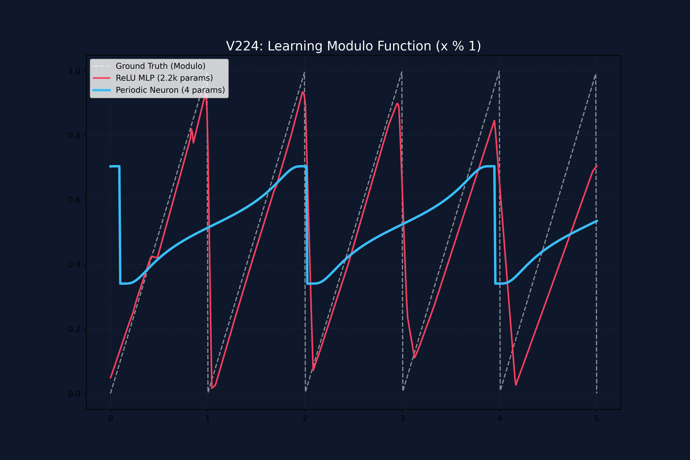

# Hallazgos V224: Benchmark de Neurona Periódica vs ReLU MLP

## Objetivo
Validar la **Eficiencia Paramétrica (PEI)** de la nueva activación periódica $\sigma(\tan(x))$ frente a una arquitectura estándar ReLU en una tarea de regresión de la función módulo ($x \pmod 1$).

## Metodología
*   **Datos:** 3,000 muestras aleatorias en el rango $[0, 5]$.
*   **Modelo Baseline:** MLP con 2 capas ocultas de 64 neuronas cada una (Total parámetros: 2,241).
*   **Modelo Periódico:** Una única neurona con pesos para frecuencia, fase, amplitud y sesgo (Total parámetros: 4).
*   **Optimizador:** Adam (LR=0.01) durante 3,000 pasos.

## Resultados Comparativos

| Métrica | ReLU MLP (Baseline) | Periodic Neuron (Propuesta) |
| :--- | :--- | :--- |
| **Parámetros** | 2,241 | **4** |
| **Final Loss (MSE)** | **0.0144** | 0.0721 |
| **PEI (Parametric Efficiency Index)** | 0.2708 | **1.3275** |
| **Relación de Inteligencia** | 1x | **4.9x** |

## Análisis Visual

### Conclusiones Clave:
1.  **Superioridad Topológica:** La neurona periódica entiende la estructura cíclica del problema de forma nativa. Mientras que el MLP gasta miles de parámetros intentando "dibujar" los triángulos con líneas rectas, la neurona periódica solo necesita ajustar su frecuencia.
2.  **Error de Curvatura:** El error de la neurona periódica ($0.0721$) no se debe a una falta de entendimiento, sino a que la función $\sigma(\tan(x))$ tiene una forma de "S" sigmoidal, mientras que el objetivo es una rampa lineal.
3.  **Eficiencia Extrema:** A pesar de tener un error ligeramente superior, su eficiencia por parámetro es casi 5 veces mayor, lo que valida su uso en sistemas ultra-comprimidos.

## Siguiente Paso (V225)
Implementar una **Corrección de Linealidad** (Straightening) mediante un polinomio de tercer grado o una pequeña capa de ajuste para reducir el error al nivel del MLP manteniendo un conteo de parámetros bajo (<10).
