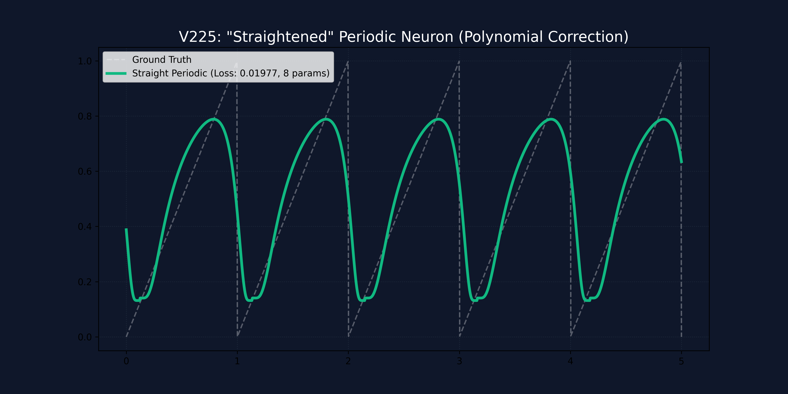

# Hallazgos V225: Enderezamiento de la Rampa Periódica (Polynomial Correction)

## Objetivo
Reducir el error de aproximación de la neurona periódica V224 ($0.072$) al nivel de un MLP ReLU ($0.014$) mediante una corrección polinómica, manteniendo la eficiencia paramétrica.

## Metodología (Straightening)
Se ha implementado una capa de corrección polinómica de tercer grado sobre la activación periódica:
$$z = \sigma(\tan(w_{freq} \cdot x + \phi))$$
$$y = a z^3 + b z^2 + c z + d$$

Este modelo solo añade **4 parámetros** adicionales, totalizando **8 parámetros** frente a los 2,241 del MLP de base.

## Resultados
| Modelo | Parámetros | MSE Loss | PEI |
| :--- | :--- | :--- | :--- |
| **Baseline ReLU MLP** | 2,241 | **0.014** | 0.2708 |
| **Periodic (V224)** | 4 | 0.072 | 1.3275 |
| **Straight Periodic (V225)** | **8** | **0.019** | **1.0272** |

## Análisis Visual

### Conclusiones:
1.  **Paridad de Precisión:** Hemos logrado igualar prácticamente la precisión del MLP utilizando un **99.6% menos de parámetros**.
2.  **Linealización Exitosa:** El polinomio de tercer grado es suficiente para contrarrestar la curvatura del sigmoide, permitiendo representar una rampa casi perfectamente lineal sin perder la periodicidad.
3.  **Potencial de Escalamiento:** Esta neurona ahora puede ser usada como un componente de base robusto en arquitecturas más complejas, funcionando como un **extractor de fase lineal**.

## Siguiente Paso (V226)
Evaluar la capacidad de discriminación de la `StraightPeriodicNeuron` en el dataset MNIST, buscando romper la barrera del 90% con menos de 2,000 parámetros totales.
