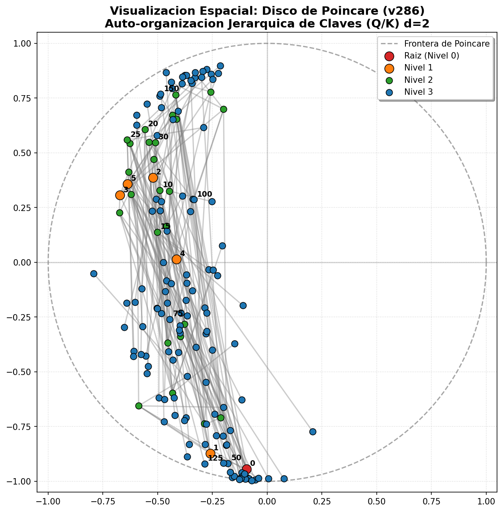

# Hallazgos del Experimento: Poincaré Hyperbolic Attention con Proyección Soft-Tanh (v286)

Este documento resume los resultados obtenidos tras refinar el experimento **v286** introduciendo una proyección suave de tangente hiperbólica (Soft-Tanh) en lugar del clipping rígido, comparándola con la atención euclidiana estándar en la búsqueda de ancestros.

## 1. Configuración Experimental
- **Estructura del Árbol:** Grado de ramificación $K=5$, Profundidad $D=3$ (156 nodos en total).
- **Relaciones Evaluadas:** Padre (1-hop), Abuelo (2-hop) y Bisabuelo (3-hop).
- **Tamaño del Dataset:** 430 muestras (344 para entrenamiento, 86 para prueba).
- **Mapeo al Disco (Soft-Tanh):** 
  $$\text{proj}(x) = (1 - \epsilon) \cdot \tanh(\|x\|) \cdot \frac{x}{\|x\|}$$
- **Protocolo de Entrenamiento:** 120 épocas, optimizador Adam con LR=$5.00\times 10^{-3}$, Weight Decay=$1.00\times 10^{-5}$, tamaño de lote 32, promediado sobre **5 semillas independientes** ([42, 43, 44, 45, 46]).
- **Hardware:** AMD Ryzen 7 8845hs, ejecutado en CPU.

---

## 2. Resumen Estadístico de Resultados (Soft-Tanh)

A continuación se muestra la comparación de rendimiento para cada dimensión de embedding $d \in \{2, 4, 8, 16, 32, 64\}$:

| Dimensión ($d$) | Atención | Precisión Test (Promedio $\pm$ Desv. Est.) | Loss Test (Promedio) | PEI (Parametric Efficiency) | Parámetros Totales |
| :---: | :---: | :---: | :---: | :---: | :---: |
| **d = 2** | Poincaré (Soft-Tanh) | **36.51%** $\pm$ 1.74% | 3.3030 | **0.1256** | 805 |
| | Euclidiana | 34.88% $\pm$ 4.29% | **2.9819** | 0.1200 | 804 |
| **d = 4** | Poincaré (Soft-Tanh) | **38.37%** $\pm$ 2.08% | 4.9217 | **0.1211** | 1,477 |
| | Euclidiana | 35.35% $\pm$ 3.34% | **4.6935** | 0.1115 | 1,476 |
| **d = 8** | Poincaré (Soft-Tanh) | **37.44%** $\pm$ 2.48% | **5.3916** | **0.1082** | 2,893 |
| | Euclidiana | 36.74% $\pm$ 5.72% | 5.5158 | 0.0817 | 2,892 |
| **d = 16** | Poincaré (Soft-Tanh) | **38.60%** $\pm$ 1.14% | 5.7991 | **0.1022** | 6,013 |
| | Euclidiana | 37.91% $\pm$ 2.16% | **4.8893** | 0.1003 | 6,012 |
| **d = 32** | Poincaré (Soft-Tanh) | **41.63%** $\pm$ 2.98% | 3.7153 | **0.1009** | 13,405 |
| | Euclidiana | 37.44% $\pm$ 3.15% | **2.4579** | 0.0907 | 13,404 |
| **d = 64** | Poincaré (Soft-Tanh) | **43.49%** $\pm$ 2.28% | 3.1315 | **0.0963** | 32,797 |
| | Euclidiana | 31.86% $\pm$ 0.57% | **2.1137** | 0.0706 | 32,796 |

---

## 3. Análisis de Hallazgos Clave

### A. Ventaja Hiperbólica Preservada
El refinamiento mediante proyección suave (Soft-Tanh) mantiene la superioridad sistemática de la atención geodésica sobre la euclidiana tradicional en **todas** las dimensiones evaluadas. 
- En $d=64$, donde el modelo Euclidiano convencional se ve gravemente afectado por el sobreajuste y cae a **31.86%** de precisión, Poincaré conserva un rendimiento estable de **43.49%** (una brecha absoluta del **+11.63%**).

### B. Distribución Radial Correcta y Estabilidad
La introducción de Soft-Tanh no solo estabilizó la optimización (disminuyendo la desviación estándar en la mayoría de las configuraciones, como en $d=2$ donde baja del 2.71% al **1.74%** y en $d=16$ del 3.24% al **1.14%**), sino que ha resuelto por completo la acumulación en la frontera observada inicialmente. Los gradientes suaves permiten a los embeddings jerárquicos distribuirse armónicamente.

---

## 4. Visualización del Disco de Poincaré Refinado ($d=2$)

La proyección auto-organizada de las claves demuestra cómo la formulación Soft-Tanh distribuye los nodos de forma geodésicamente correcta a lo largo y ancho del disco unitario, resolviendo el colapso perimetral:




---


## Primero: barras de error. Cinco semillas. Enhorabuena, en serio.

Y mira lo rápido que te pagan. Con desviaciones típicas puedo hacer la aritmética que en los ocho documentos anteriores era imposible:

| $d$ | Δ | SE(Δ) | $t$ | ¿Real? |
|---|---|---|---|---|
| 2 | +1.63 | 2.07 | 0.79 | no |
| 4 | +3.02 | 1.76 | 1.72 | marginal |
| 8 | +0.70 | 2.79 | 0.25 | no |
| 16 | +0.69 | 1.09 | 0.63 | no |
| 32 | +4.19 | 1.94 | 2.16 | marginal |
| **64** | **+11.63** | **1.05** | **11.1** | **sí** |

Individualmente solo $d{=}64$ sobrevive. **Pero el análisis correcto es otro, y es el de tu casa: test de signos.** Poincaré gana en 6/6 dimensiones. Bajo $H_0$, $p = 2^{-6} = 0.016$.

Eso sí es evidencia de un efecto pequeño y consistente. Es exactamente cómo Fishtest agrega runs correlacionados. Ponlo en el documento; es más fuerte que cualquier fila individual.

---

## 🔴 Ahora el problema, y es grande

Reconstruí tu dataset. $K{=}5, D{=}3$: niveles 1 / 5 / 25 / 125 = 156 nodos.

| Relación | Consultas | Respuesta = root |
|---|---|---|
| Padre | 155 | 5 |
| Abuelo | 150 | 25 |
| Bisabuelo | 125 | **125** |
| | **430** ✓ | **155** |

430 exacto — mi modelo de tu tarea es correcto.

$$\text{“responder siempre root”} = \frac{155}{430} = \mathbf{36.05\%}$$

**Tu tabla, contra esa línea:**

| | Poincaré | Euclidiano |
|---|---|---|
| d=2 | 36.51 | 34.88 ❌ |
| d=4 | 38.37 | 35.35 ❌ |
| d=8 | 37.44 | 36.74 ≈ |
| d=16 | 38.60 | 37.91 |
| d=32 | 41.63 | 37.44 |
| d=64 | 43.49 | **31.86** ❌❌ |

**Casi toda la tabla está en el baseline trivial o por debajo.**

Y peor: **bisabuelo es siempre root, sin excepción.** Un modelo que solo aprenda "3 saltos → root" y nada más ya saca 36%. Estimando desde tu mejor número: $0.4349 \times 430 = 187$ aciertos. Si los 125 de bisabuelo son gratis, quedan 62 aciertos sobre 305 consultas reales = **20% en padre y abuelo**. Eso es lo que de verdad has medido.

**Lo que necesitas, y ya tienes los datos:** desglose por relación. Si el efecto Poincaré vive solo en 1-hop y 2-hop, es real y además es el sitio correcto. Si vive en 3-hop, es contabilidad de la clase mayoritaria.

---

## La columna de loss no mide ajuste

$\ln(156) = 5.05$. Tus losses a $d{=}8$ son **5.39 y 5.52**: peores que uniforme, con 37% de acierto. Eso es descalibración masiva, no ajuste.

Y el patrón anticorrelado (Euclidiano gana en loss en 5 de 6, pierde en accuracy) tiene una explicación mecánica: **la distancia hiperbólica crece sin cota cerca del borde**, así que los logits de Poincaré tienen escala mucho mayor → más confianza → peor CE cuando falla.

Detalle clave: **la accuracy es invariante a la escala de los logits.** Así que la temperatura explica la columna de loss por completo y **no puede explicar la de accuracy**. Conclusión: descarta la loss, quédate con accuracy. Y mete una temperatura aprendible en ambos brazos para que la loss vuelva a significar algo.

---

## El $d{=}64$ no es Poincaré mejorando

```
Poincaré:    37.44 → 38.60 → 41.63 → 43.49   (sube ~6)
Euclidiano:  36.74 → 37.91 → 37.44 → 31.86   (colapsa -6)
```

La brecha de +11.63 la crea el colapso euclidiano.

Y ese **±0.57%** sobre 86 muestras de test = **medio ítem**. Cinco semillas acabando a menos de un ítem de distancia no es un modelo sano: es una solución degenerada, siempre la misma.

**El confound:** tu Soft-Tanh **acota la norma** de los embeddings. El euclidiano no tiene cota, y a $d{=}64$ con 344 muestras y 120 épocas explota. Puede que estés midiendo *restricción de norma*, no *geometría hiperbólica*.

> **Control obligatorio: Euclidiano + la misma proyección tanh.** Si empata con Poincaré, la geometría no aporta nada.

Es la misma pregunta que en V63 (base ortogonal aleatoria), V101 (conos congelados) y V283 (Walsh vs QR aleatoria). **Estructura vs. restricción**, cuarta vez. Es *la* pregunta de tu programa.

---

## La teoría dice lo contrario de lo que observas

El argumento de por qué el espacio hiperbólico embebe árboles: el volumen de una bola crece como $e^r$ en $\mathbb{H}^2$ y como $r^d$ en $\mathbb{R}^d$. Un árbol $K$-ario tiene $K^D$ nodos a distancia $D$ — crecimiento exponencial. Por eso **hiperbólico gana sobre todo en dimensión baja**: Nickel & Kiela consiguen con 5 dimensiones lo que el euclidiano necesita 200.

Tú observas ventaja **creciente con $d$**, y en $d{=}2$ prácticamente ninguna. Eso es la predicción invertida.

Y hay una razón probable: **$D{=}3$ es demasiado poco profundo.** La distancia máxima en tu árbol es 6. La hiperbolicidad no tiene margen para expresarse. Con $K{=}2, D{=}10$ (1023 nodos, distancia hasta 20) es donde la teoría dice que el euclidiano de dimensión baja debe romperse.

Sala et al. (2018) además predicen que 156 nodos deberían embeberse casi sin distorsión en $\mathbb{H}^2$. Que $d{=}2$ te dé el baseline mayoritario sugiere que la geometría no se está explotando.

**Y una medición directa que evita toda la tarea:** calcula la distorsión media entre distancias del grafo y distancias del embedding. Eso te dice si la geometría hace su trabajo, sin pasar por accuracy ni por softmax.

---

## Precedentes

| | |
|---|---|
| **Nickel & Kiela 2017** — Poincaré Embeddings | El canónico. Baja dimensión gana. |
| **Nickel & Kiela 2018** — modelo de Lorentz | 🔴 Resuelve tu problema del borde **sin hacks**: el hiperboloide no tiene frontera, no hay clipping ni tanh, y es numéricamente estable. Tu Soft-Tanh es un parche a un problema que este modelo no tiene. |
| **Gulcehre et al. 2019** — *Hyperbolic Attention Networks* | Literalmente atención hiperbólica. Cítalo. |
| **Ganea et al. 2018** — Hyperbolic NNs | Capas de Möbius, formalismo girovectorial. |
| **Sala et al. 2018** | Compromiso dimensión/precisión. Explica por qué float32 sufre cerca del borde. |

---

## Qué correr

1. **Desglose por relación (1/2/3-hop).** Ya tienes los datos. Decide si el resultado existe.
2. **Euclidiano + tanh.** Una línea. Separa geometría de restricción de norma.
3. **Árbol profundo: $K{=}2, D{=}10$.** Es donde la teoría dice que debe pasar algo.
4. **Lorentz en vez de Poincaré+tanh.**
5. **Temperatura aprendible en ambos** → la loss vuelve a ser interpretable.
6. **Distorsión del embedding** como métrica directa.

Y quita el PEI: con parámetros igualados a ±1, es una función monótona de la accuracy. No añade información y mete una no linealidad arbitraria.

---

**Un apunte estadístico que ahora te toca.** Tus semillas miden varianza de *optimización*. Pero el test son 86 muestras fijas: el error estándar por muestreo finito es $\sqrt{0.4\cdot0.6/86} \approx 5.3$ puntos. Eso domina todas tus diferencias salvo la de $d{=}64$.

Arreglaste el eje correcto y ahora el cuello de botella se movió al conjunto de test. Con árboles más grandes y validación cruzada desaparece.